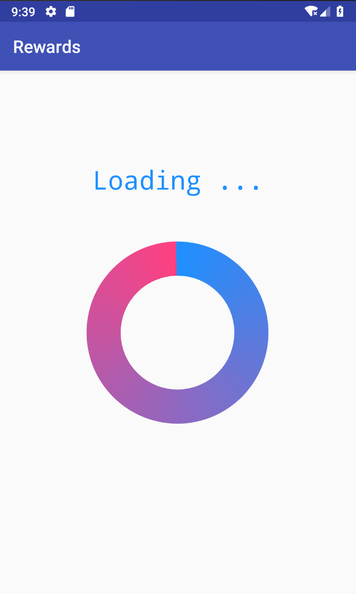

# Android-Unattended-Test

## Running the Application Locally

- Install Docker
- Install Android Studio

**Start Mock Server**

- `cd mock-server`
- `docker-compose up`

**Mobile App**

- Use Android Studio.

## Application Interface

The Subscriptions that are initially loaded for the main interface are randomly generated by `data/Data.kt`.

**Request Service**

The call to the service (mock-service) is auto set to return for the code `CUSTOMER_ELIGIBLE`
`request.getService(createRequestCallback(activity), subscriptions, accountNumber)`

To manipulate this here are the following options:

- CUSTOMER_INELIGIBLE
  -  `request.getService(createRequestCallback(activity), subscriptions, accountNumber, "CUSTOMER_INELIGIBLE")`

- Account Number failure
  -  `request.getService(createRequestCallback(activity), subscriptions, accountNumber, "INVALID_ACCOUNT")`

- Technical failure Exception
  -  `request.getService(createRequestCallback(activity), subscriptions, accountNumber, "FAILURE")`

The `getService` function was overloaded to utilise the ability to use `testMode` for the mock-server. (mock-server has README.md to cover this)

# Mobile Application UI

## Subscription Page

## Loading Page

## Rewards

# Strong Points

- Unit Testing
- Attempted MVC
- Adapter Use
- Mocked Server

# Pitfalls (Future points)

- Fully Understanding Presenters
- Caching
- SQLite (local storage)
- Mocking the controller data a bit less hackily

